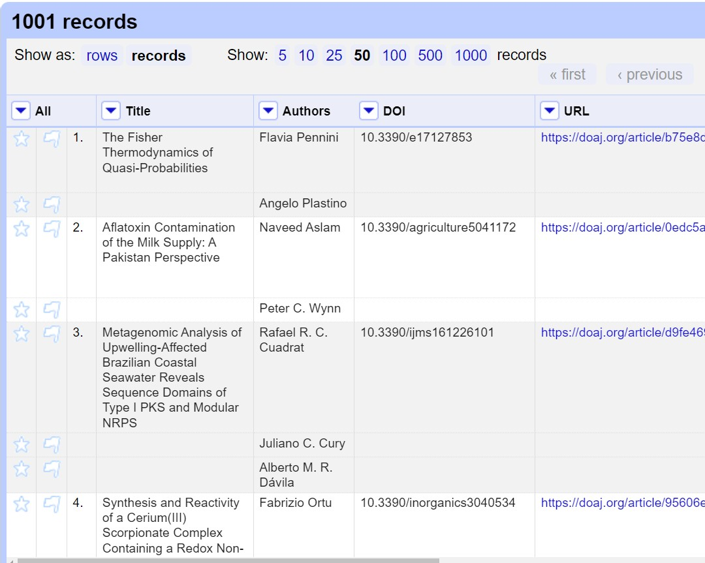

::::::::::::::::::::::::::::::::::::::: objectives

- Locate controls for navigating data in OpenRefine
- Find options to work with data through the OpenRefine dropdown menus
- Split cells which contain multiple bits of data so that each piece of data is in its own cell

::::::::::::::::::::::::::::::::::::::::::::::::::

:::::::::::::::::::::::::::::::::::::::: questions

- How is data organised in OpenRefine?
- How do I access options to amend data in OpenRefine?
- What is the difference between Rows and Records in OpenRefine?
- How do I work with single cells that contain multiple values in a list?

::::::::::::::::::::::::::::::::::::::::::::::::::

## The layout of OpenRefine

OpenRefine displays data in a tabular format. Each row will usually represent a 'record' in the data, while each column represents a type of information. This is very similar to how you might view data in a spreadsheet or database. As with a spreadsheet, the individual bits of data live in 'cells' at the intersection of a row and a column.

OpenRefine only displays a limited number of rows of data at one time. You can adjust the number choosing between 5, 10 (the default), 25 and 50 at the top left of the table of data. You can navigate through the records by using the previous/next/first/last navigation options at the top right of the table of data.

In OpenRefine it is always possible to undo any changes: note the left panel, currently empty. Read the four words at the top of the panel:
Facet/Filter and Undo/Redo.  We will focus on the undo/redo commands much later in the workshop; you are welcome to use it at anytime, as needed.

## Working with data in OpenRefine

Most options to work with data in OpenRefine are accessed from drop down menus at the top of the data columns. When you select an option in a particular column (e.g. to make a change to the data), it will affect all the cells in that column. If you want to make changes across several columns, you will need to do this one column at a time.

## Rows and Records

OpenRefine has two modes of viewing data: 'Rows' and 'Records'. At the moment we are in Rows mode, where each row represents a single record in the data set - in this case, an article. In Records mode, OpenRefine can link together multiple rows as belonging to the same Record. Rows will be assigned to Records based on the values in the first column. See more [details of Rows and Records in the OpenRefine documentation](https://docs.openrefine.org/manual/exploring#rows-vs-records).

### Splitting Cells

To see how this works in practice we can split author names into separate cells. If you look at the Author column you should be able to see that there are multiple names in each cell separated by the pipe symbol ( | ).

To work with the author names effectively in OpenRefine, we need to have each name in an individual cell. To split the names into their own cells, we can use a `Split multi-valued cells` function:

- Click the dropdown menu at the top of the Author column
- Choose `Edit cells->Split multi-valued cells`
- In the prompt type the ( | ) symbol and click `OK`
  - Note that the rows are still numbered sequentially
- Click the `Records` option to change to Records mode
  - Note how the numbering has changed - indicating that several rows are related to the same record

{alt='Screen capture showing OpenRefine in Rows mode.'}
{alt='Screen capture showing OpenRefine in Rows mode.'}

Note in the images above the difference between: Rows with the same Title appear below each shared title, interrupted the numbered sequence in the third column from the left. Shared titles have the same shading, which may be very difficult to distinguish visually, so look for each star and flag in the leftmost columns, which indicates a new row, that is an item with a different author.

Now that we can split multi-valued cells, we'll cover how to join them back together.

### Joining Cells

A common workflow with multi-valued cells is

- split multi-valued cells into individual cells (what we did above)
- modify/refine/clean individual cells
- join multi-valued cells back together

Modifying cells will be covered in future lessons, but for now we will cover how to join cells back together that have been split previously.

- Click the dropdown menu at the top of the Author column
- Choose `Edit cells->Join multi-valued cells`
- In the prompt type the ( | ) symbol
  - Here we are specifying the *delimiter* character for OpenRefine to use to join the values together.
- Click `OK` to join the Authors cells back together

You will now see that split rows have gone away - the Authors have been joined into a single cell with the specified delimiter. Our Rows and
Records values will now be the same since we do not have any more columns with split (multi-valued) cells.

- Click both the `Rows` and `Records` options and observe how the numbers of Rows and Records are equal

### Choosing a good separator

The value that separates multi-valued cells is called a separator or delimiter. Choosing a good
separator is important. In the examples, we've seen the pipe character ( | ) has been used.

Choosing the wrong separator can lead to problems. Consider the following multi-valued Author example,
with a pipe as a separator.

```
Jones, Andrew | Davis, S.
```

When we tell OpenRefine to split this cell on the pipe ( | ), we will get the following two authors each in their own cell since there is a single pipe character separating them.

- **Author 1:** Jones, Andrew
- **Author 2:** Davis, S.

Now imagine that the document creator had chosen a **comma** as the separator instead of a pipe.

```
Jones, Andrew , Davis, S.
```

Can you spot the problem? Can you tell where one author stops and the next begins?

OpenRefine will split on **every** comma it encounters,
so we'll end up with 4 authors, not two, because OpenRefine cannot tell that **Jones, Andrew** is supposed to be a single author. We will get
the following four "authors" because there are 3 commas separating the name parts.

- **Author 1:** Jones
- **Author 2:** Andrew
- **Author 3:** Davis
- **Author 4:** S.

Splitting on a comma will not work with Authors because the names may include commas within them.

:::::::::::::::::::::::::::::::::::::::::  callout

## Choose a separator that is not in your data values

When creating a spreadsheet with multi-valued cells, it is important to choose a separator that will never appear in
the cell values themselves. For this reason, the pipe character ( | ) is often a good choice since it
is rarely used in data. Commas, colons and semi-colons should be avoided as separators.


::::::::::::::::::::::::::::::::::::::::::::::::::

:::::::::::::::::::::::::::::::::::::::  challenge

## Splitting Subjects into separate cells

1. What separator character is used in the Subjects cells?
2. How would you split these subjects into individual cells?

:::::::::::::::  solution

## Solution

1. The subject words/headings are divided up with the pipe ( | ) character
2. To split the subject words into individual cells you need to:

- Click the dropdown menu at the top of the Subjects column
- Choose 'Edit cells->Split multi-valued cells'
- In the prompt type the ( | ) symbol and click 'OK'
  
  

:::::::::::::::::::::::::

::::::::::::::::::::::::::::::::::::::::::::::::::

:::::::::::::::::::::::::::::::::::::::  challenge

## Joining the Subjects column back together

1. Using what we've learned, now Join the Subjects back together

:::::::::::::::  solution

## Solution

1. The subject words/headings were previously delimited with the pipe ( | ) character
2. To join the split subject cells back to a single cell you need to:

- Click the dropdown menu at the top of the Subjects column
- Choose 'Edit cells->Join multi-valued cells'
- In the prompt type the ( | ) symbol and click 'OK'
  
  

:::::::::::::::::::::::::

::::::::::::::::::::::::::::::::::::::::::::::::::

:::::::::::::::::::::::::::::::::::::::: keypoints

- OpenRefine uses rows and columns to display data
- Most options to work with data in OpenRefine are accessed through a drop down menu at the top of a data column
- When you select an option in a particular column (e.g. to make a change to the data), it will affect all the cells in that column
- OpenRefine has a Records mode which links together multiple rows into a single record
- Split and join multi-valued cells to modify the individual values within them
- When creating multi-valued cells in your data, choose a separator that will not appear in the data values

::::::::::::::::::::::::::::::::::::::::::::::::::


