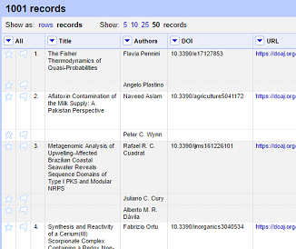
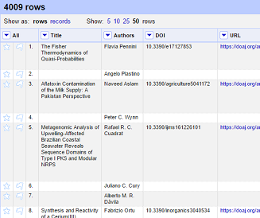

## The layout of OpenRefine
OpenRefine displays data in a tabular format. Each row will usually represent a 'record' in the data, while each column represents a type of information. This is very similar to how you might view data in a spreadsheet or database.

OpenRefine only displays a limited number of lines of data at one time. You can adjust the number choosing between 5, 10 (the default), 25 and 50.

## Reordering and renaming columns
Many operations in OpenRefine are accessed from the drop down menus at the top of each column. You can re-order the columns by clicking the drop down menu at the top of the first column (labelled 'All'), and choosing 'Edit columns->Re-order / remove columns …'

You can then drag and drop column names to re-order the columns, or remove columns completely if they are not required.

## Sorting data
You can sort data in OpenRefine by clicking on the drop down menu for the column you want to sort on, and choosing 'Sort'

Once you have sorted the data a new 'Sort' drop down menu will be displayed.

Unlike Excel 'Sorts' in OpenRefine are temporary - that is, if you remove the 'Sort', the data will go back to it's original 'unordered' state. The 'Sort' drop down menu lets you amend the existing sort (e.g. reverse the sort order), remove existing sorts, and make sorts permanent.

You can sort on multiple columns at the same time by adding another sorted column (in the same way).

## Facets
Facets are one of the most useful features of OpenRefine and can help both get an overview of the data in a project as well as helping you bring more consistency to the data.

A 'Facet' groups all the values that appear in a column, and then allow you to filter the data by these values and edit values across many records at the same time.

The simplest type of Facet is called a 'Text facet'. This simply groups all the text values in a column and lists each value with the number of records it appears in. The facet information always appears in the left hand panel in the OpenRefine interface.

To create a Text Facet for a column, click on the drop down menu at the top of the column and choose 'Facet -> Text Facet'. The facet will then appear in the left hand panel.

The facet consists of a list of values used in the data. You can filter the data displayed by clicking on one of these headings.

You can include multiple values from the facet in a filter at one time by using the 'Include' option which appears when you put your mouse over a value in the Facet.

You can also 'invert' the filter to show all records which do not match your selected values. This option appears at the top of the Facet panel when you select a value from the facet to apply as a filter.

>## Exercise 2: Which licences are used for articles in this file?
>* Create a facet for the 'Licence' column
>* What is the most common Licence in the file?
>* How many articles in the file don't have a licence assigned?
{: .challenge}

## Filters
As well as using Facets to filter the data displayed in OpenRefine you can also apply 'Text Filters' which looks for a particular piece of text appearing in a column. Text filters are applied by clicking the drop down menu at the top of the column you want to apply the filter to and choosing 'Text filter'.

As with Facets, the Filter options appear in the left hand panel in OpenRefine. Simply type in the text you want to use in the Filter to display only rows which contain that text in the relevant column.

You can also use regular expressions in the filter.

## Working with filtered data
It is very important to note that when you have filtered the data displayed in OpenRefine, any operations you carry out will apply only to the rows that match the filter - that is the data currently being displayed.

## More on Facets
As well as 'Text facets' Refine also supports a range of other types of facet. These include:

* Numeric facets
* Timeline facets (for dates)
* Custom facets
* Scatterplot facets

**Numeric and Timeline facets** display graphs instead of lists of values. The graph includes 'drag and drop' controls you can use to set a start and end range to filter the data displayed.

**Scatterplot facets** are less commonly used - for further information on these see the tutorial at [http://enipedia.tudelft.nl/wiki/OpenRefine_Tutorial#Exploring_the_data_with_scatter_plots](http://enipedia.tudelft.nl/wiki/OpenRefine_Tutorial#Exploring_the_data_with_scatter_plots)

**Custom facets** are a range of different types of facets, and also allow you write your own custom facets. Some of the default custom facets are:

* Word facet - this breaks down text into words and counts the number of records each word appears in
* Duplicates facet - this results in a binary facet of 'true' or 'false'. Rows appear in the 'true' facet if the value in the selected column is an exact match for a value in the same column in another row
* Text length facet - creates a numeric facet based on the length (number of characters) of the text in each row for the selected column. This can be useful for spotting incorrect or unusual data in a field where specific lengths are expected (e.g. if the values are expected to be years, any row with a text length more than 4 for that column is likely to be incorrect)
* Facet by blank - a binary facet of 'true' or 'false'. Rows appear in the 'true' facet if they have no data present in that column. This is useful when looking for rows missing key data.

Facets are intended to group together common values and OpenRefine limits the number of values allowed in a single facet to ensure the software does not perform slowly or run out of memory. If you create a facet where there are many unique values (for example, a facet on a 'book title' column in a data set that has one row per book) the facet created will be very large and may either slow down the application, or OpenRefine will not create the facet.

>## Exercise 3: Find all publications without a DOI
>* Use the 'Facet by blank' function to find all publications in this data set without a DOI
{: .challenge}

## Amending data through facets
If you create a text facet you can edit the values in the facet to change the value for several records at the same time. To do this, simply mouse-over the value you want to edit and click the 'edit' option that appears.

This approach is useful in relatively small facets where you might have small variations through punctuation or typing errors etc. For example, a column that should contain only terms from a small restricted list such as days of the week or months of the year.

The list of values in the facet will update as you make edits.

>## Exercise 4: Correct the Language values via a facet
>* Create a Text facet on the Language column
>* Notice that there is both 'EN' and 'English'
>* Put the mouse over the 'English' value
>* Click 'Edit'
>* Type 'EN' and click 'Apply'
>* See how the Language facet updates
{: .challenge}

# Rows and Records
OpenRefine has two modes of viewing data 'Rows' and 'Records'. So far we've been using the Rows mode, where each row represents a single record in the data set - in this case, an article. In Records mode, OpenRefine can link together multiple rows as belonging to the same Record.

How this works can be seen in the next exercise...

>## Exercise 5: Split author names into separate cells
>If you look at the Author column you should be able to see that there are multiple names in each cell separated by the pipe symbol "|". >To work with the author names effectively we need to split them into separate cells:
>
>* Click the dropdown menu at the top of the Author column
>* Choose 'Edit cells->Split multi-valued cells'
>* In the prompt type the "\|" symbol and click 'OK'
>    * Note that the rows are still numbered sequentially
>* Click the 'Records' option to change to Records mode
>    * Note how the numbering has changed - indicating that several rows are related to the same record
{: .challenge}

 

## Clustering
The Cluster function groups together values in a column that are 'similar' and enables you to merge together several different, but similar, values into a single value.

This is very effective where you have data where there can be minor variations in data values that are likely such as names of people, organisations and places.

To use the 'Cluster' function, click on the 'Edit Cells' menu option in the relevant column and choose 'Cluster and edit...'

The 'Clusters' are created automatically according to an algorithm. There are a number of different algorithms supported by OpenRefine - some experimentation maybe required to see which clustering algorithm works best with any particular set of data, and you may find that using different algorithms highlights different clusters.

For more information on the methods used to create Clusters see [https://github.com/OpenRefine/OpenRefine/wiki/Clustering-In-Depth](https://github.com/OpenRefine/OpenRefine/wiki/Clustering-In-Depth)

For each cluster you have the option of 'merging' the values together - that is replace with a single consistent value. By default OpenRefine uses the most common value in the cluster as the new value, but you can select one of the other values by clicking the value itself, or you can simply type the desired value into the 'New Cell Value' box.

The Clustering function can also be accessed via the drop down menu at the top of a column by selecting 'Edit cells->Cluster and edit …'

>## Exercise 6: Use Clustering to clean up author data
>* Choose 'Edit cells->Cluster and edit' from the author column (which should be split into individual values from the last exercise)
>* Using the 'key collision' method with the 'fingerprint' Keying Function work through the clusters of values, merging them to a single value where appropriate
>* Try changing the clustering method being used - which ones work well?
{: .challenge}
